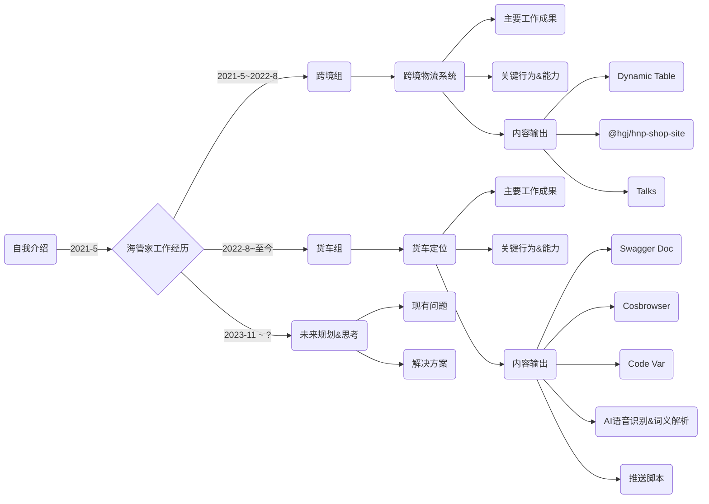

# 陶翔 - 职级晋升述职 

货车组-前端开发 P4 升 P5

  

  

      <a class="mr-4" target="_blank" title="项目源码" href="https://github.com/wingsheep/talks">
      <ri-github-line class="opacity-50"/>
      Source
    </a>
     <a  target="_blank" title="项目源码" href="https://github.com/wingsheep/talks/raw/master/2022-07-10/2023-11-24-rank-promotion.pdf">
      <ri-download-line class="opacity-50"/>
      Download
    </a>
  

  
Suzhou, China 2023

---

# 内容概览

---
layout: intro
---
<h1 text="!5xl">陶翔</h1>

从事前端开发行业五年，工作内容涉及领域包括交通，教育，金融，物流等。  
主要技术栈vue，react，熟悉产品开发中的各个流程。  
其他对于如Nodejs脚本开发，Vscode插件，Raycast插件开发等也积累一定的开发经验。

  <ri-gitlab-line class="opacity-50"/>
  
<a href="https://github.com/wingsheep" target="_blank">taoxiang.tao</a>

  <ri-github-line class="opacity-50"/>
  
<a href="https://github.com/wingsheep" target="_blank">wingsheep</a>

---
layout: center
class: text-center
---

# 海管家工作经历
2021-5-24 入职海管家，职位前端开发

---
layout: center
class: text-center
---

#  跨境组-跨境物流系统
2021-5 ~ 2022-8 期间，主要负责跨境物流系统的相关开发工作

---

# 跨境物流系统

    
一个基于vue3开发的多端项目 包括后台管理端、后台员工端 二级客户端（PC、 H5、小程序、公众号）

  

---

# 主要工作成果 

> 承担当时重要紧急的多端建站模块的开发任务

> 重构升级后台管理系统，提高后台稳定性，提升团队开发体验

# 关键行为&能力

> 重新开发建站npm包，解决建站多端行为不统一的问题

> 抽离重复的业务，开发动态表格，提高了团队开发效率

> 开发后台开发环境自动登录部署脚本，提升了团队开发体验

> 参与组内技术分享，提高组内开发技术氛围

# 未来规划&思考

> 公司人事调整，调离到货车组，待续。。。

# 内容输出

> <ri-link class="opacity-50 mr-4"/><a href="https://wingsheep.github.io/zh-CN/component/dynamic-table.html" target="_blank">Dynamic Table</a>

> <ri-link class="opacity-50 mr-4"/><a href="http://nexus.hgj.net/#browse/browse:npm-internal:%40hgj%2Fhnp-shop-site" target="_blank">@hgj/hnp-shop-site</a>

> <ri-link class="opacity-50 mr-4"/><a href="https://www.talks.happyfly.top/2022/vue3-ecosystem/1" target="_blank">技术分享</a>

---
layout: center
class: text-center
---

#  货车组-货车定位
2022-8 ~ 至今，主要负责货车定位小程序的相关开发工作

---

# 货车定位

  
一个C端产品，具有多个入口 包括微信小程序，抖音小程序 其他复制小程序，神北小程序 后台管理端，PC，h5端，公众号等

  

  
  
  
  

---

# 主要工作成果 

> 小程序历史遗留问题优化(代码冗余，文档缺失，部署繁复)

> 小程序打包体积持续优化

> 重构升级后台管理系统，提高后台稳定性，可维护性

# 关键行为&能力

> 小程序打包优化&上传&推送消息，提升部署效率，减少沟通成本

> 开发Vscode, Raycast效率插件，减少重复性工作，提升开发效率

> 应用Nuxt3技术方案，即能提升系统稳定性，又能沉淀技术经验

> 调研技术可行性，如Flutter, React Native跨平台框架，AI应用等

# 内容输出

> <ri-link class="opacity-50 mr-4"/><Link to="11">Swagger Doc 文档管理插件</Link>

> <ri-link class="opacity-50 mr-4"/><Link to="12">Cosbrowser CDN管理插件</Link>

> <ri-link class="opacity-50 mr-4"/><Link to="13">Code Var 变量命名插件</Link>

# 其他

> <ri-link class="opacity-50 mr-4"/><Link to="14">AI 语音识别&词义解析</Link>

> <ri-link class="opacity-50 mr-4"/><Link to="15">企业微信群消息推送</Link>

---

# Swagger Doc
Vscode 插件，用于管理Swagger 文档，支持生成ts，js代码段

 

  

      <a  target="_blank" title="项目源码" href="https://github.com/wingsheep/swagger-doc">
      <ri-github-line class="opacity-50"/>
      GitHub
    </a>
  

---

# Cosbrowser
RayCast插件， 支持上传下载文件，图片预览&压缩，复制路径&自定义代码段

  
  
  
  

  

      <a  target="_blank" title="项目源码" href="https://github.com/wingsheep/cosbrowser">
      <ri-github-line class="opacity-50"/>
      GitHub
    </a>
  

---

# Code Var
RayCast插件， 基于有道翻译开发的变量命名插件，支持全类型的变量命名

  

      <a  target="_blank" title="项目源码" href="https://github.com/wingsheep/code-var">
      <ri-github-line class="opacity-50"/>
      GitHub
    </a>
  

---

# AI 语音识别&词义解析

基于openAi 提供的GPT whisper-1 模型和text-davinci-003模型的实现语音识别和词义解析

<CustomVideo />

---

# 企业微信群消息推送

用于推送小程序重新部署信息，以便于测试 & 每日资讯推送

  

      <a  target="_blank" title="项目源码" href="https://github.com/wingsheep/newsBot">
      <ri-github-line class="opacity-50"/>
      GitHub
    </a>
  

---
layout: center
class: text-center
---

# 未来规划&思考
思考现有工作的一些问题与解决方案

---

# 现有问题

<v-clicks :every='2'>

> 由于历史遗留问题，UI组件难以升级，且与业务相耦合，导致小程序主包体积难以继续优化，对于后续功能开发有风险

 

> 四个复制小程序多分支管理混乱，开发部署效率极低

 

> 小程序发布缺乏规范的CI/CD流程

</v-clicks>

 
 
 

<v-clicks :every='2'>

# 未来规划

> 深入理解业务逻辑，将UI组件移除，预计将减少主包10%的体积，后续尝试升级框架，彻底解决打包问题

 

> 四个复制小程序大同小异，可梳理差异点做配置化管理，脚本一键部署

 

> 可尝试在后台管理系统加入小程序发布管理

 

</v-clicks>

---
layout: center
class: 'text-center pb-5 :'
---

# 谢谢！Q & A
