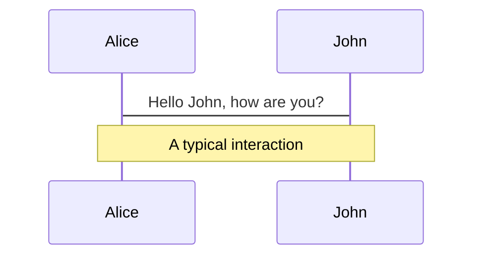
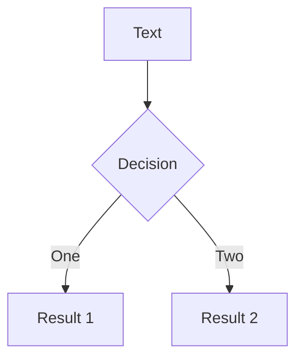
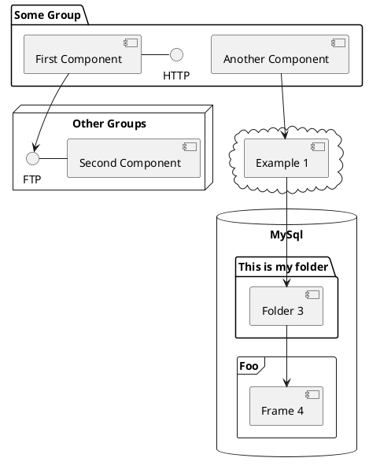

# Vue3 优雅的开发项目

分享Vue3项目中好用的包及工具，提高开发效率，减少心智负担，提升开发体验，重拾开发乐趣

<div class="abs-tr !mx-8 !my-8 flex flex-col bg-blue-500 dark:bg-transparent px-2 py-2 rounded">
  
</div>

<div class="abs-bl !mx-14 my-12 flex flex-col">
  <div class="mb-3 uppercase tracking-widest font-500">
  <a href="https://www.talks.happyfly.top">跨境组 - talks</a>
  </div>
  <div class="text-md opacity-50">Suzhou, China 2022</div>

</div>

<style>
p {
  @apply text-xl;
}
</style>

---
layout: intro
---
# 跨境物流系统

<div class="leading-8 opacity-80">一个基于vue3开发的多端项目<br>包括后台管理端、后台员工端<br>二级客户端（PC、 H5、小程序、公众号、<strike>App</strike>）<br>
 </div>

<div class="my-10 grid grid-cols-[40px,1fr] w-max gap-y-4 pt-24">
  <ri-user-3-line class="opacity-50"/>
  <div><a href="https://kj.hgj.com" target="_blank">邵富旺·张超烨·王源·陈成·陶翔·<strike>陈颜颜·张辉·?·?</strike></a></div>
  <ri-download-line class="opacity-50"/>
  <div><a href="https://www.talks.happyfly.top" target="_blank">www.talks.happyfly.top</a></div>
</div>


---
layout: center
class: text-center
---

# Vue3用啥包管理器好呢？

npm or yarn ？

---

# 都可以，更推荐使用pnpm

Fast, disk space efficient package manager


- 磁盘空间利用非常高效
> pnpm 内部使用基于内容寻址的文件系统来存储磁盘上所有的文件, 不会重复安装同一个包
- 包安装速度极快
> 因为下载包的数量与下载速度成正比，包少了当然快
- 支持monorepo
> 用一个 git 仓库来管理多个子项目，所有的子项目都存放在根目录的packages目录下，那么一个子项目就代表一个package, 可替代<a href="https://github.com/lerna/lerna#readme">lerna</a>，
常用UI组件库如<a href="https://github.com/element-plus/element-plus">ElementPlus</a>等都已使用了pnpm进行包管理，使用其monorepo特性维护子包。
- 安全性高
> npm/yarn 的时候，由于 node_module 的扁平结构, 可能会导致某些包的依赖关系不能被正确解析，会出现这种非法访问的情况, 而pnpm 使用软链的方式将项目的直接依赖添加进模块文件夹的根目录，避免了这种情况。

<style>
h1 {
  background-color: #eeaf3d;
  background-image: linear-gradient(45deg, #4e4e4e 10%, #eeaf3d 20%);
  background-size: 100%;
  -webkit-background-clip: text;
  -moz-background-clip: text;
  -webkit-text-fill-color: transparent;
  -moz-text-fill-color: transparent;
}
</style>

---

# 不同的包管理器如何切换?

推荐安装<a href="https://github.com/antfu/ni"> antfu/ni </a>包，可以识别当前项目所使用的的包管理器，并且可以自动切换到相应的包管理器，抹平不同的包管理器的命令差异，运行相应的脚本

```js
npm i -g @antfu/ni

```

<br>
<br>
<br>
<br>
<br>

# Nodejs版本如何切换?

macos 使用 <a href="https://github.com/nvm-sh/nvm">nvm</a>
<br>
windows 使用 <a href="https://github.com/coreybutler/nvm-windows"> nvm-windows</a>

```js
npm i -g nvm

```

---
layout: center
class: text-center
---

# vue3用啥工具链/脚手架？

能用vite就用vite, 次之也最好升级到vue-cli5或webpack5

---
layout: center
class: text-center
---

# 如何优雅的导入包？
全量引入 or 按需引入？

---
layout: center
class: text-center
---

# 如何优雅的使用Composition API？
看看vueuse是如何实现的

---
layout: center
class: text-center
---

# 如何优雅的进行状态管理？
vuex4 ?

---
layout: center
class: text-center
---


# 如何优雅的使用svg组件和icon图标？
iconfont or svgIcon ?

---
layout: center
class: text-center
---

# 我想要在项目中使用CSS原子化引擎
tailwinds or windicss ?

---
layout: center
class: text-center
---

# 我的项目要求SSR
nuxt3不二之选

---
layout: center
class: text-center
---

# 你以上说的我都接受，但我不想配置
有现成的项目模板？

---

# Navigation

Hover on the bottom-left corner to see the navigation's controls panel, [learn more](https://sli.dev/guide/navigation.html)

### Keyboard Shortcuts

|     |     |
| --- | --- |
| <kbd>right</kbd> / <kbd>space</kbd>| next animation or slide |
| <kbd>left</kbd>  / <kbd>shift</kbd><kbd>space</kbd> | previous animation or slide |
| <kbd>up</kbd> | previous slide |
| <kbd>down</kbd> | next slide |

<!-- https://sli.dev/guide/animations.html#click-animations -->

<p v-after class="absolute bottom-23 left-45 opacity-30 transform -rotate-10">Here!</p>

---
layout: image-right
image: https://source.unsplash.com/collection/94734566/1920x1080
---

# Code

Use code snippets and get the highlighting directly![^1]

```ts {all|2|1-6|9|all}
interface User {
  id: number
  firstName: string
  lastName: string
  role: string
}

function updateUser(id: number, update: User) {
  const user = getUser(id)
  const newUser = { ...user, ...update }
  saveUser(id, newUser)
}
```

<arrow v-click="3" x1="400" y1="420" x2="230" y2="330" color="#564" width="3" arrowSize="1" />

[^1]: [Learn More](https://sli.dev/guide/syntax.html#line-highlighting)

<style>
.footnotes-sep {
  @apply mt-20 opacity-10;
}
.footnotes {
  @apply text-sm opacity-75;
}
.footnote-backref {
  display: none;
}
</style>

---

# Components

<div grid="~ cols-2 gap-4">
<div>

You can use Vue components directly inside your slides.

We have provided a few built-in components like `<Tweet/>` and `<Youtube/>` that you can use directly. And adding your custom components is also super easy.

```html
<Counter :count="10" />
```

<!-- ./components/Counter.vue -->
<Counter :count="10" m="t-4" />

Check out [the guides](https://sli.dev/builtin/components.html) for more.

</div>
<div>

```html
<Tweet id="1390115482657726468" />
```

<Tweet id="1390115482657726468" scale="0.65" />

</div>
</div>


---
class: px-20
---

# Themes

Slidev comes with powerful theming support. Themes can provide styles, layouts, components, or even configurations for tools. Switching between themes by just **one edit** in your frontmatter:

<div grid="~ cols-2 gap-2" m="-t-2">

```yaml
---
theme: default
---
```

```yaml
---
theme: seriph
---
```


</div>

Read more about [How to use a theme](https://sli.dev/themes/use.html) and
check out the [Awesome Themes Gallery](https://sli.dev/themes/gallery.html).

---
preload: false
---

# Animations

Animations are powered by [@vueuse/motion](https://motion.vueuse.org/).

```html
<div
  v-motion
  :initial="{ x: -80 }"
  :enter="{ x: 0 }">
  Slidev
</div>
```

<div class="w-60 relative mt-6">
  <div class="relative w-40 h-40">
    
    
    
  </div>

  <div
    class="text-5xl absolute top-14 left-40 text-[#2B90B6] -z-1"
    v-motion
    :initial="{ x: -80, opacity: 0}"
    :enter="{ x: 0, opacity: 1, transition: { delay: 2000, duration: 1000 } }">
    Slidev
  </div>
</div>

<!-- vue script setup scripts can be directly used in markdown, and will only affects current page -->
<script setup lang="ts">
const final = {
  x: 0,
  y: 0,
  rotate: 0,
  scale: 1,
  transition: {
    type: 'spring',
    damping: 10,
    stiffness: 20,
    mass: 2
  }
}
</script>

<div
  v-motion
  :initial="{ x:35, y: 40, opacity: 0}"
  :enter="{ y: 0, opacity: 1, transition: { delay: 3500 } }">

[Learn More](https://sli.dev/guide/animations.html#motion)

</div>

<!--
asdfdsaf
-->

---

# LaTeX

LaTeX is supported out-of-box powered by [KaTeX](https://katex.org/).

<br>

Inline $\sqrt{3x-1}+(1+x)^2$

Block
$$
\begin{array}{c}

\nabla \times \vec{\mathbf{B}} -\, \frac1c\, \frac{\partial\vec{\mathbf{E}}}{\partial t} &
= \frac{4\pi}{c}\vec{\mathbf{j}}    \nabla \cdot \vec{\mathbf{E}} & = 4 \pi \rho \\

\nabla \times \vec{\mathbf{E}}\, +\, \frac1c\, \frac{\partial\vec{\mathbf{B}}}{\partial t} & = \vec{\mathbf{0}} \\

\nabla \cdot \vec{\mathbf{B}} & = 0

\end{array}
$$

<br>

[Learn more](https://sli.dev/guide/syntax#latex)

<!--
sadfdsafdsafsdfsdafsdafdsf
-->

---

# Diagrams

You can create diagrams / graphs from textual descriptions, directly in your Markdown.

<div class="grid grid-cols-3 gap-10 pt-4 -mb-6">







</div>

[Learn More](https://sli.dev/guide/syntax.html#diagrams)


---
layout: center
class: text-center
---

# Learn More

[Documentations](https://sli.dev) · [GitHub](https://github.com/slidevjs/slidev) · [Showcases](https://sli.dev/showcases.html)
